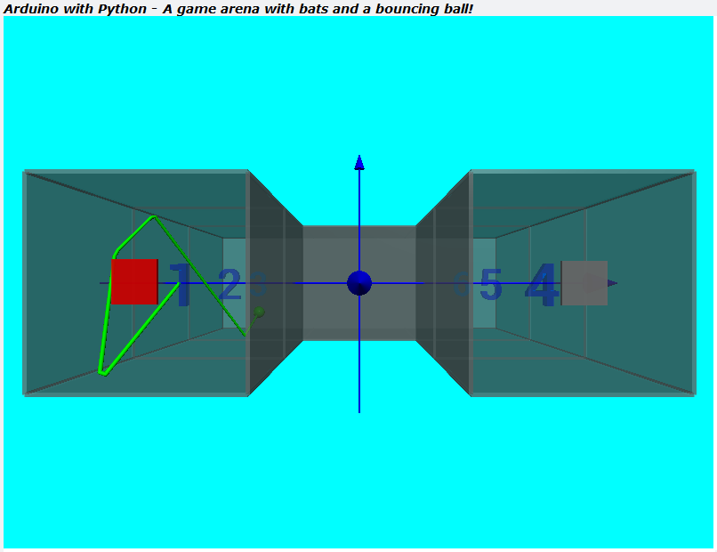

# TTB-AP-Lesson16
My Solution to Paul McWhorter's "Arduino with Python: LESSON 16" homework.

Visit Paul's video here:
 - https://youtu.be/watch?v=7Z_vPoTfREE

You can get Paul's code here:
 - https://toptechboy.com/

You can see my solution demonstrated here:
 - https://youtu.be/A-OvP9Mt6_w

This week we have been back with hardware, Arduino code, python code and it all working together. I now have seven boxes, or arenas, in a "U" shape, and the ball is bouncing up and down and around the bend. As it does so, LEDs and piezo buzzer react. At each end of the "U" there is a bat and they can each be moved by the joystick attached to the Arduino. Pressing the joystick button allows you to change from one bat to the other. At the moment the bats do not interact with the ball... I suspect that will be next weeks homework.

## My Game Arena with Bats and a Bouncing Ball:

